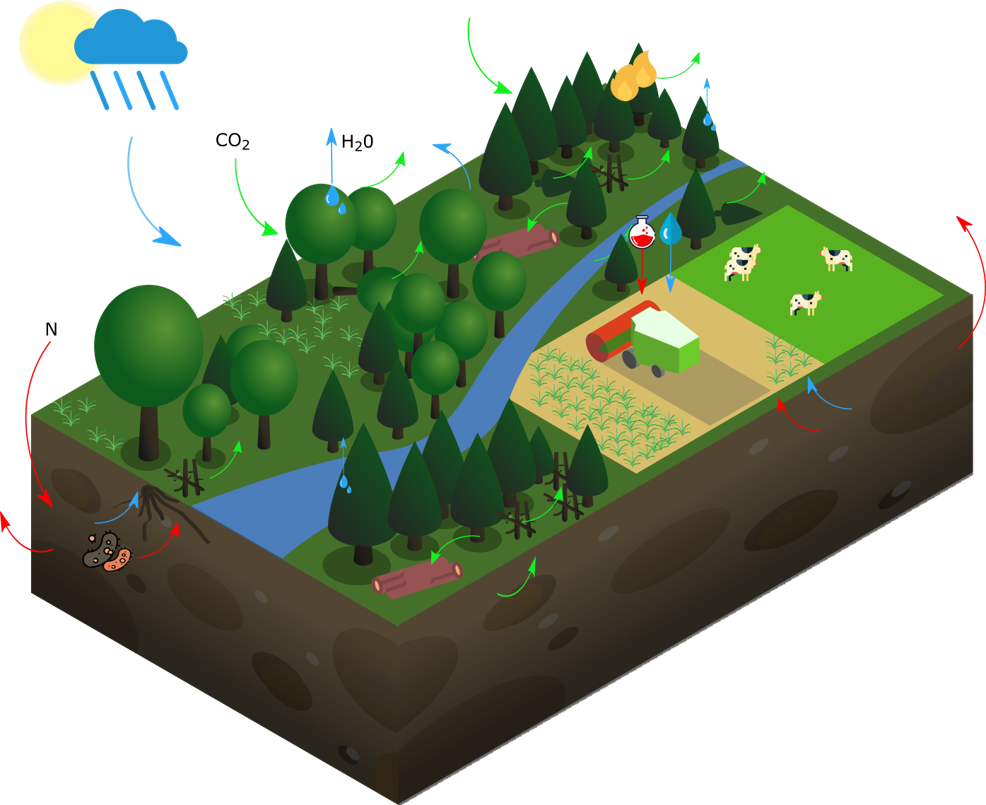
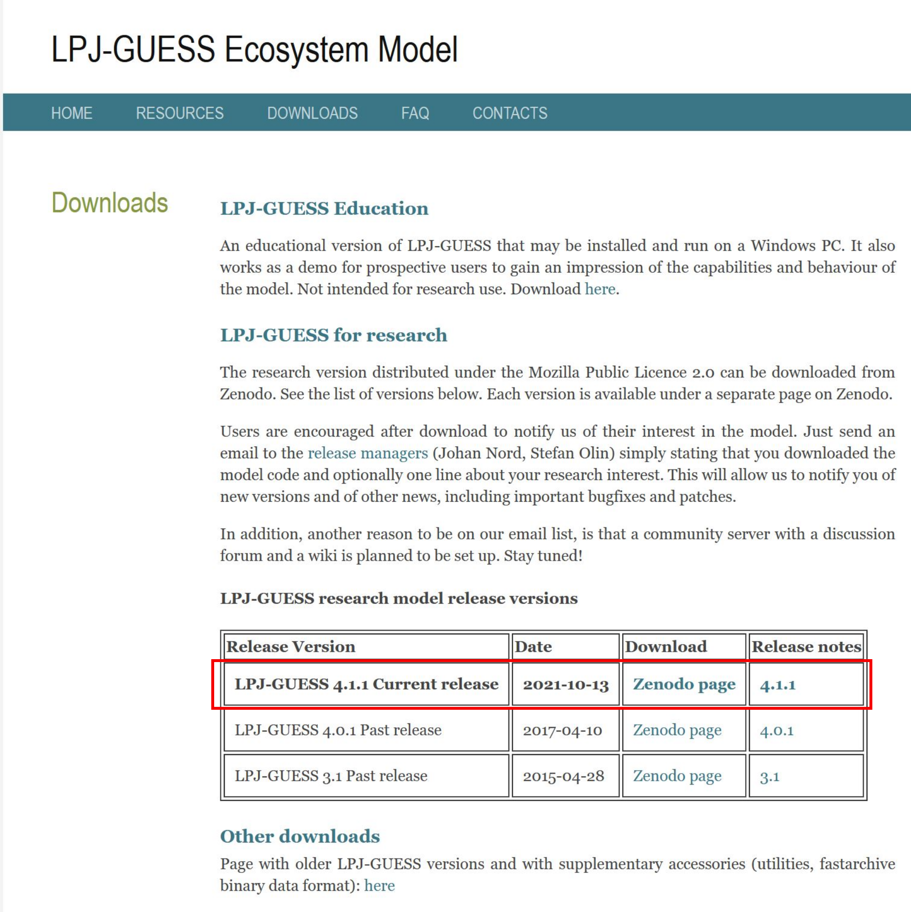

[LPJ-GUESS](https://web.nateko.lu.se/lpj-guess/) has recently been made openly available, but there is not yet much guidance on how to use the model.

In this tutorial, you will learn how to download, compile and run LPJ-GUESS with some demo data. 

## The model

LPJ-GUESS is a dynamic global vegetation model that simulates the effects of climate, land use and management on ecosystem functioning. The model simulates vegetation structure, distribution, composition, and biogeochemical cycles (water, carbon, nitrogen).

 
Source: Natel de Moura, Carolina (2023). Representation of LPJ-GUESS. figshare. Figure. https://doi.org/10.6084/m9.figshare.24454738.v1

## Tutorial

1. Downloading LPJ-GUESS
2. Installing the requirements
3. Compiling LPJ-GUESS
4. Testing LPJ-GUESS with demo data

> **_NOTE:_** The instructions are for Linux. However, it is possible to run LPJ-GUESS on Windows. You can follow the instructions in the software package in reference/guessdoc.pdf, section: Compiling on Windows with Visual Studio.

### Requirements:

- Linux
- Your computer's hard drive must have at least 2GB of free space.
- Internet access
- Your computer must be a 64-bit system. LPJ-GUESS does not support 32-bit compilation.

Below you will find step-by-step instructions on how to create a local directory for your LPJ-GUESS project, install the necessary software, compile LPJ-GUESS and test it with demo input data.

Download the software -> Compile the software -> Test it with demo data

### 1: Downloading LPJ-GUESS

Let's start by creating a folder on your computer for your LPJ-GUESS projects. The path and folder name on your computer will be referred to here as <your_project_folder>.

```
   mkdir <your_project_folder>
   cd <your_project_folder>
```
Now, go to the [developer's website](https://web.nateko.lu.se/lpj-guess/download.html) and download the zipped archive from Zenodo page. Make sure to download the latest release.



Then unzip the downloaded folder, and copy the subfolder guess_4.1 and all its contents to your <your_project_folder>.

```
C:\USERS\USERNAME\DOWNLOADS\8065737\GUESS_4.1.1\GUESS_4.1
└───guess_4.1.1
    └───guess_4.1
        ├───benchmarks
        ├───build
        ├───cmake
        ├───command_line_version
        ├───data
        ├───doxygen
        ├───framework
        ├───libraries
        ├───modules
        ├───parallel_version
        ├───reference
        ├───tests
        └───windows_version
```
You should end up with something like this:
```
<your_project_folder>
└──guess_4.1
   ├───benchmarks
   ├───build
   ├───cmake
   ├───command_line_version
   ├───data
   ├───doxygen
   ├───framework
   ├───libraries
   ├───modules
   ├───parallel_version
   ├───reference
   ├───tests
   └───windows_version
```
### 2. Installing the requirements
#### Install a C++ compiler and Cmake

If you already have a C++ compiler and cmake installed on your computer, you can skip this subsection. You can check this by typing:

```
   ccmake --version
```

If the version is printed on the screen, then you can skip the next step. Otherwise, install it as described below:

```
   sudo apt-get install cmake-curses-gui
```

To check if you have the compiler, type:

```
   gcc-9 --version
```

If the version is printed on the screen, then you can skip the next step. Otherwise, 
install it as described below:

```
   sudo apt update
   sudo apt upgrade
   sudo apt install build-essential
```

It is likely that you now have g++ on your system (thanks to build-essentials).
 You can check this with the `ls` command below:

```
   ls /usr/bin/gcc*
```

If this command shows that you already have gcc-9 installed (one of the output items should be: gcc-ar-9), you can skip the next line. If not, follow the steps below to install it:

```
   sudo apt -y install gcc-9 g++-9*
   ls /usr/bin/gcc*
```
#### 3. Compiling LPJ-GUESS

Here we build the LPJ-GUESS executable (`guess`) using the LPJ-GUESS code you downloaded above, cmake and the compiler.

```
   cd <your_project_folder>/guess_4.1/build
   ccmake ..
```
`cmake` should open an interactive session. In this session:

- Press <kbd>c</kbd> to configure
- Then press <kbd>t</kbd> to show advanced options
- Press <kbd>c</kbd> again
- Press <kbd>g</kbd> to generate and exit. 

Then run the following command in the build folder:

```
   make
```

Make sure that the output of `make` has no errors (warnings are OK), the output should end with "[100%] Built target guess". 
Check that the `guess` executable was created in `<your_project_folder>/guess_4.1/build/`

### 4. Testing LPJ-GUESS with demo data 

It is good practice to create a separate directory within `<your_project_folder>` to store the output of your model runs. So go ahead and create a folder called, for example, runs.

```
   cd <your_project_folder>
   mkdir runs
   cd runs
```
Now we need to copy some instruction files and a gridlist example from the LPJ-GUESS source code folder (`guess_4.1`) into the runs/ subdirectory.

```
   cp ../guess_4.1/data/ins/*.ins .
   cp ../guess_4.1/data/gridlist/gridlist_global.txt .
```

Then make a symbolic link to the executable 'guess'

```
   ln -s ../guess_4.1/build/guess .
```

If you are initially testing the model with demo input data, start by editing this file:
`<your_project_folder>/runs/europe_demo.ins`.

You must edit this instruction file with the absolute path to all the input data required for your project.

Open the `europe_demo.ins` file, and change the line:

```
   param "file_gridlist" (str "gridlist_global.txt")
```
into

```
   param "file_gridlist" (str "/home/<your_user>/<your_project_folder>/runs/gridlist.txt")
```

Also change the lines below with the path on your computer to your input data. The demo data is located in 
`guess_4.1/data/env/`

```
   param "file_temp" (str "tmp30_21.grd") ! temperature
   param "file_prec" (str "prc30_21.grd") ! precipitation
   param "file_sun" (str "clo30_21.grd") ! sunshine
   param "file_soil" (str "soils_lpj.dat") ! Path to LPJ soil code file
```
into
```
   param "file_temp" (str "/home/<your_user>/<your_project_folder>/guess_4.1/data/env/tmp30_21.grd") ! temperature
   param "file_prec" (str "/home/<your_user>/<your_project_folder>/guess_4.1/data/env/prc30_21.grd") ! precipitation
   param "file_sun" (str "/home/<your_user>/<your_project_folder>/guess_4.1/data/env/clo30_21.grd") ! sunshine
   param "file_soil" (str "/home/<your_user>/<your_project_folder>/guess_4.1/data/env/soils_lpj.dat") ! Path to LPJ soil code file
```

**_TIP:_** Enter the full absolute path, not relative paths.

Also, edit a copy of your gridlist file,
removing all but the 2 first lines, and making sure that the file ends with a blank line. This is just to quickly test the model in a few grid cells, to see if it's working.

For example, do:

```
    head -n 2 gridlist_global.txt > gridlist.txt
```

In the `<your_project_folder>/runs` folder,run the model like this:

```
   ./guess -input demo ..\..\data\ins\europe_demo.ins
```

If you already have your own data, you should run it using your own input module. For example, using the cru_ncep input module:

```
    ./guess -input cru_ncep guess.ins
```

If everything has been done correctly, you should have the model outputs in your `runs` folder. A description of the available LPJ-GUESS outputs can be found [here](https://web.nateko.lu.se/lpj-guess/education/docs/outvars.html).

If there are any error messages, take action to resolve the error message: most likely it is that `guess` 
cannot find this or that file. If this is the case, make sure that the paths in the file `europe_demo.ins` are correct, and 
use absolute paths (e.g. `<your_project_folder>/gridlist.txt`) rather than relative ones (e.g. `../gridlist.txt`).

If the execution of the model is "Finished" and shows no errors, then you are finished with this installation of LPJ-GUESS, and ready to start working with it.

Now look at the output data, make some plots and explore the results. Next you should prepare your own input data and run the model for the location of your choice, specifying the geographical coordinates in a `gridlist.txt` file.

In this tutorial you have learnt how to download, compile and run LPJ-GUESS with demo data for the first time. For more information about the model, see the materials in `guess_4.1/reference`.

Do you have any questions?
Drop me a line at carolina.natel at gmail [dot] com and I will do my best to answer.

